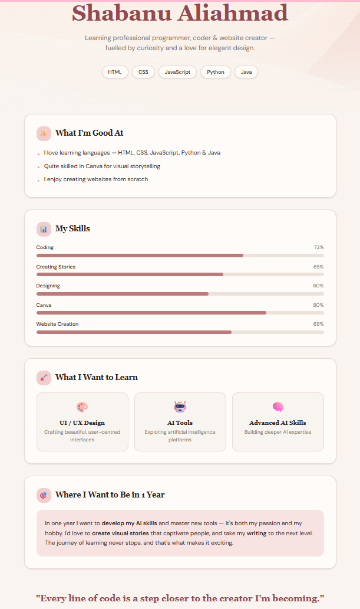

# Skill Tracker (Lovable Edition)

A modern, interactive Skill Tracker web application built with Lovable. This version focuses on a high-quality user experience and a sleek, responsive interface.

## Live Demo
Experience the live application here: 
[https://skill-canvas-charm.lovable.app](https://skill-canvas-charm.lovable.app)

## Key Features
- **Modern UI/UX**: Built with a focus on clean design and intuitive navigation.
- **Fast Performance**: Optimized for speed and responsiveness across all devices.
- **Real-time Interaction**: Interactive elements for tracking skills and progress seamlessly.

## Preview

## Technology Stack
- **Platform**: Lovable
- **Framework**: React / Vite (standard Lovable stack)
- **Styling**: Tailwind CSS
